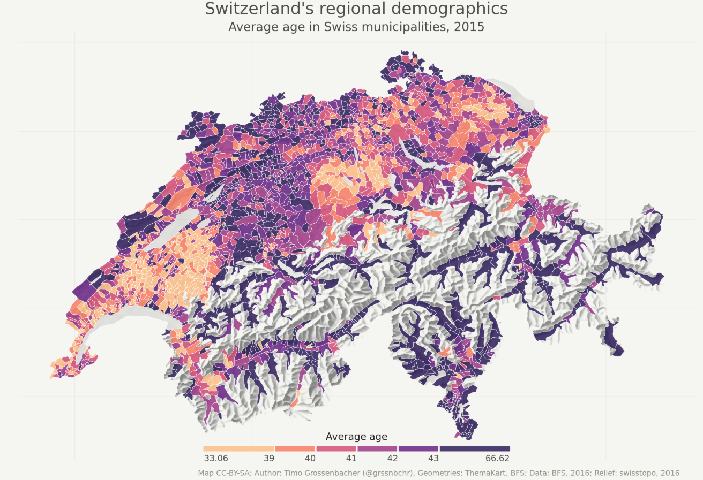

# A first note

[Google](https://www.google.com/?hl=fr): You **will** run into problems while using R, it happens **all the time** and for **all level**. A wise saying is that a programmer is good because he knows what to search on Google. Before sending a question because something does not work, **search on google!**. **Then** if you struggled for a long time and are still stuck you can post your question on BlackBoard or send me a mail at **benjamin.cretois@ntnu.no**

# Set up instructions & quick introduction to R

First of all, R and RStudio are two different programs. R is the underlying statistical computing environment (the program you use to do the statistics and GIS), but using R alone is no fun (it is very ugly!). RStudio is a <b>graphical integrated development environment (IDE)</b> that makes using R much easier and more interactive. You need to install R before you install RStudio.

### Install R

I assume that some of you have Mac OS while others have windows (some of you may have Linux). No problem in all cases!

for MAC download the R-3.6.1.pkg from this [website](https://cran.r-project.org/bin/macosx/) 
for Windows download R from [here](http://cran.r-project.org/bin/windows/base/release.htm)
If you have Linux I'm sure you can easily find a way to install R ;)

Now you can open R, see how ugly it is! To make the visual better let's install Rstdio!

### Install Rstdio

Download and install the version 1.1.463 from the [Rstudio website](https://support.rstudio.com/hc/en-us/articles/206569407-Older-Versions-of-RStudio). Make sure you download Mac OS X if you are using a Mac and Windows if you are using ... Windows.


### R and Rstudio
***
Okay, I have been a little bit fast with my explanations about R and R studio. In this section I will go more in details.

## What is R? What is RStudio?

The term “R” is used to refer to both the programming language to write scripts and the software (“environment”) that interprets the scripts written in R. It is an alternative to other statistical packages such as SPSS (what was used for this course before), Stata or Matlab. R lets you perform a wide variety of things: data vizualisation, statistics, GIS and a whole lot more! In fact, this document is written in R :)

R studio is an interface which allows you to interact with R in a much funnier way. You can write your scripts, open projects and make your programming life easier.

## GIS in R

In this exercise we won't do statistics but only simple GIS tasks. Now, why learning R in complement of ArcGIS?

  * R is one of the most used programming language
  * R is free and open source
  * R produces high quality graphics 
  * R is a programming language, which means that you can automatize tasks and save everything in a script, making everything reproducible
  
## Knowing your way around RStudio

Let’s start by learning about RStudio, which is once again an Integrated Development Environment (IDE) for working with R. The RStudio IDE is an open source product and is free. 

During this course - and hopefully after this course - you will use RStudio IDE to write code, navigate the files on our computer, inspect the variables we are going to create, and visualize the plots we will generate.


```{r echo=FALSE, out.width='80%'}
knitr::include_graphics("docs/Exercise_1/R.png")
```

RStudio is divided into 4 “Panes”:

  * the Source for your scripts and documents (top-left, in the default layout),
  * the R Console (bottom-left),
  * your Environment/History (top-right), and
  * your Files/Plots/Packages/Help/Viewer (bottom-right).
  
Note that the placement of these panes and their content can be customized (see main Menu, Tools -> Global Options -> Pane Layout). I must say that I like it as it is but feel free to modify it!

## Open a script

The basis of programming is that we write down instructions for the computer to follow, and then we tell the computer to follow those instructions. We write, or **code**, instructions in R because it is a common language that both the computer and we can understand. We call the instructions **commands** and we tell the computer to follow the instructions by **executing** (also called running) those commands.

Because we want to keep our code and workflow, it is better to type the commands we want in the script editor, and save the script. This way, there is a complete record of what we did, and anyone (including our future selves!) can easily replicate the results on their computer.

To open a new script follow these steps:
On the main menu go to `Files` > `New File` > `R script` to open a new script

The most important aspects of making your code comprehensible for others and your future self is adding comments about why you did something. You can write comments directly in your script, and tell R not no execute those words simply by putting a hashtag `#` before you start typing the comment.

For instance like this:

```{r eval=FALSE} 
#I comment by adding a hashtag
view(data) #I can directly comment a line of code like this

```

# Basic GIS tools in R
***

In this exercise I will present the (very) basic functions of R for doing GIS.

## Prerequisite

For this part of the exercise you will need multiple libraries. In R, a library extends the number of function in R. It is like adding a google to a rifle, you improve its capability.

For this exercise we will need a few packages so you first need to install (write the following code in your script):

```{r, eval=FALSE}
install.packages('tidyverse')
install.packages('sf')
install.packages('raster')
install.packages('spData')
```

The packages take a bit of time to be installed, be patient and have a look at the additional ressources!

You then need to tell R to use these packages:

```{r, eval=TRUE, message=FALSE}
library(tidyverse)
library(sf)
library(raster)
library(spData)
```

## Load the data

We will open a dataset named "world". It countains diverse informations about the countries of the world. The dataset is comprised in the spData package and you do not need to import it from your computer.

```{r, eval=TRUE}
# We first import the dataset in R
world <- world

# Vizualise what are the variables stored in the dataset
names(world)

# Make a quick map of the world population, the choice of the colours is bad and we will work on better maps do not worry!
plot(world["pop"])
```

The first thing to notice is that the **world** object has 177 obs (which refers to observations, in this case these are the countries) and 11 variables (which are what we have recorded in the countries including their population, gpd, life expectancy ...)

Other useful functions to learn more about our dataset include `summary()`, `head()` and `tail()`, try them out! Now that we know a bit more about our dataset and what it contains we will isolate the countries we are interested in. We will work with Europe.

## GIS work

**In my case I work with Europe but you have to use your country given in the "AContinent4Me" pdf**

To isolate the European area we need to use the function `filter()`

```{r, eval=TRUE}
# Create an object europe which contains all european countries. 
europe <- world %>% filter(continent == "Europe")

# We check if our function worked
plot(europe["pop"])
```

In the bunch of code above we are basically saying "I want **europe** to be all the countries of **world** for which the **column** continent is equal to **Europe**". We use the operator `==` which stands for **equal to**

So far we have isolate Europe but we do not want to include Russia or French polynesia!

We can remedy this problem by filtering out Russia:

```{r, eval=TRUE}
# Here I filter out Russia from the dataset.
europe <- europe %>% filter(name_long != 'Russian Federation')
```

Contrary to previously, here we say "I want **europe** to be **europe** for which the column **name_long** do not contain **Russian Federation** (which is the ISO code for Russia)". The operator `!=` stands for **non-equal to** 

We will also create a "bounding box" or BB which helps us to isolate the area of interest and zoom on it.

Note that the bounding box will be different depending on your continent. You will have to change the values below. How to figure out the bounding box for your continent? Look at [this website](http://bboxfinder.com/#0.000000,0.000000,0.000000,0.000000), you will find the coordinates in the lower left of your screen. I let you figure out what is x and what is y.

```{r echo=FALSE, out.width='150%'}
knitr::include_graphics("docs/Exercise_1/coordinates.png")
```

```{r}
# First we need to set the delimination of the obunding box. These are the geographical coordinates and we are using the projection WGS84
xmin <- -27.06
xmax <-  43.28
ymin <- 33.33
ymax <- 72.18

# Here, I tell R to create the BB based on the coordinates I set. crs stands for coordinate reference system. We set it to 4326 which is the code for WGS84.
bbox_europe <- st_bbox(c(xmin=-27.06, xmax=43.28, 
                         ymin=33.33, ymax=72.18), crs=4326)

# I need to transform the bbox to a "simple feature column (sfc)" to be able to do some GIS tasks with it.
bbox_europe_sfc <- st_as_sfc(bbox_europe)

# I finally "intersect" the BB and europe to get what I want -> a zoom in my area of interest.
europe_final <- st_intersection(europe, bbox_europe_sfc)

# Plot the final output!
plot(europe_final[, "pop"])
```

## Import a raster of world temperature

Drawing basic maps, filtering in and out areas of interest is nice and useful but there is much more you can do in R! 

Here, we will import a raster dataset and link it to the european countries so we can vizualize the **annual mean temperatures** in the different European countries.

First we need to extract the climate data and load them in R. To get the data you can:

  * Load them online from the [worldclim data website](https://www.worldclim.org/).
  * Through the package `raster`, which we already loaded in R.
  
Given that the website is being redisigned (click on the link) we will load the data directly in R. Basically, the `raster` package has a function which directly asks internet to retrieve the data for us and load it in R, making our life very easy. This is done using the bunch of code below:

**Note that I am isolating the raster of the annual mean temperature, however you may work on a different raster dataset. Refer to ARaster4me to know with which raster you will be working**.

Refer to [this website](https://www.worldclim.org/data/bioclim.html) to know what the number of your raster represent.

```{r, eval=TRUE}
# With this line of code we ask R to store all the 12 climatic rasters available in the object "worldclim_data" (for a full description of them, refers to the website). The object worldclim_data is now a list of 12 rasters
worldclim_data <- getData("worldclim", var="bio", res=10)

# I only want the temperature data, which is the first raster from the list. We isolate the first raster from the list above.

temp <- worldclim_data[[1]] # NOTE THAT YOU NEED TO REPLACE THE NUMBER WITH YOUR RASTER! 

# And we plot the temperatures!
plot(temp)
```

## Some basic raster manipulations

The temperatures are in degree celsius. Now you might say that there is no way the temperature in Costa Rica is close to 300 degrees celsius and you would be totally right.

WorldClim data has a scale factor of 10, meaning that a temperature of 300 is in reality 30 degrees celsius. The raster are rescaled to save some memory, integer numbers consume less memory than decimal numbers.

In our case we do not really care about saving memory so we will rescale the `temp` raster. It is very basic calculation similar to the `raster calculator` function present in ArcGIS.

```{r, eval=TRUE}
# In a nutshell, we divide all cells of the raster by 10, giving us the real temperatures in degree celsius.
temp_rescaled <- temp / 10
plot(temp_rescaled)
```

A very useful thing we can do it to crop the raster to the extent of Europe, just not to have the entire world! For that we use the `mask()` function.

```{r}
# Crop the raster. First argument is your the temperature raster and second argument is the shapefile of Europe.
temp_crop <- mask(temp_rescaled, europe_final)

# Plot the raster
plot(temp_crop)
```

The map is small but the important is that the function worked as we expected. We will use this object later when drawing the maps.

Now that we have rescaled and visualize our raster we want to know the annual mean temperature for each European countries. In this raster, a pixel represents an area of 10x10km and we need to compute the mean of all cells within a specific country. For that we use the function `extract()`

```{r, eval=TRUE}
# With this line we make the average of the raster cells values within a specific country. The arguments are respectively the raster, the shapefile of Europe, the operation you want to do (fun) and we specify that we remove the cells with missing values
europe_temp <- extract(temp_rescaled, europe_final, fun=mean, na.rm=TRUE)

# The code above will create a vector of 32 values. This represent the 32 temperature means for each country. But we do not know what is the respective value for each country yet.

# Now we need to append the vector of values to our European dataset to see the average temperature per country
europe_final$temperature <- europe_temp

# Finally we plot our results
plot(europe_final["temperature"])
```

Et voilà! Now we have the average mean temperature for each country in Europe!

The map is not very pretty though and we will do better ...


# Drawing a beautiful map with R
***

We can do better than what we did above. Here I will introduce ways of getting more fancy maps in R. Why R over ArcGIS for drawing maps? Because we have much more freedom and it is easier to customize.

## Prerequisite

In this part we will need another package. `tmap` is a package which have been released in 2016 and is relatively new. However, it is very easy to manipulate and give you a lot of flexibility to create maps.

As done in the previous section we need to install the package and load it in R:

```{r, eval=FALSE}
install.packages('tmap')
```

```{r, eval=TRUE, message=FALSE}
library(tmap)
```

## tmap basics

`tmap` follow the **grammar of graphics**. This involves a separation between the input data and the aesthetics (how data are vizualised). This also means that `tmap` works with **layers**. It is like adding brick to a construction.

The basic building block of our construction is `tm_shape()`. This is followed **by one or more layer element** such as `tm_fill()` and / or `tm_dots` (there is much more ...).

Because examples are more instructive than text here is some code (explained of course).

```{r}

# Add a 'fill' layer to your map - grey is the base option
tm_shape(europe_final) +
  tm_fill()

# Add the country borders to your map
tm_shape(europe_final) +
  tm_borders()

# Combine the two above to fill the countries
tm_shape(europe_final) +
  tm_fill() +
  tm_borders()
```

The object passed to `tm_shape()` is europe_final, which contains the European countries. Layers are then added to represent europe_final visually, with `tm_fill` and `tm_shape`. So as said we **add** aesthetic layers using the operator `+`.

A useful feature of `tmap` is that it can store objects representing maps, which make it possible to save maps and do other operations with it.

```{r}
# We store the map in the map_europe object
map_europe <- tm_shape(europe_final) +
  tm_polygons()

# We plot the map
map_europe
```

New shapes can be added via `+ tm_shape(new_obj)`. For instance, if we want to overlay our raster layer on top of our European map we would write

```{r, message=FALSE}
map_europe <- tm_shape(europe_final) +
  tm_polygons() +
  tm_shape(temp_crop) +
  tm_raster(alpha=0.7)
map_europe
```

Here we basically add the raster on top of the European map with `tm_raster`. Note that I included an alpha, which represent the transparancy, so we can see the borders of the European countries.

Now, you can also plot what we calculated before which is the annual mean temperature for each country. We included this variable in the europe_final dataset and we can tell `tm_fill()` to add colors depending on this variable only.

```{r}
# Sometimes R think that a variable is categorical (for instance blue, red, yellow) are categories. To make sure that R understands that temperature is a numeric variable (with numbers) we specify this with the function "as.numeric()"
europe_final$temperature <- as.numeric(europe_final$temperature)

# I store the map in the object map_europe. I specify that I want the color (col) of the map to represent the column "temperature".
map_europe <- tm_shape(europe_final) +
  tm_polygons(col="temperature")

# Show the map!
map_europe
```

The maps look a bit better now right?

## Color settings and other manipulations

Color settings are an important part of map making. The legend is also important to set as it could sometimes be misleading.

You can set the breaks you want for the legend of your map. For instance, I can choose breaks of 5 degree celsius instead of the default 2 degrees:

```{r}
# I create an object (here a vector) containing the desired breaks
breaks <- c(0,5,10,15,20)

# I plot the map with the desired breaks
tm_shape(europe_final) + 
  tm_polygons(col="temperature", breaks=breaks)
```

I can also choose to have another color palette. There is a lot of color palette available in R. Check the [palette and there codes](https://datavizpyr.com/introduction-to-color-palettes-in-r-with-rcolorbrewer/). For instance I choose purple to represent the temperature (even though very misleading!)

```{r}
tm_shape(europe_final) + 
  tm_polygons(col="temperature", breaks=breaks, palette="Purples")
```

There is much more you can do and I would advise you to have a look at the **GeocompR** ressource than I added in the Additional ressources section.

## Layouts

The map layout refers to the combination of all maps elements into a cohesive map. Map elements include the object to be mapped, the title, the scale bar, margins and aspect ratio.

Additional elements such as the north arrow and scale bar have their own functions: `tm_compass()` and `tm_scale_bar()`

```{r}
# The layers we have been using so far
tm_shape(europe_final) +
  tm_polygons(col="temperature") +
  
  # Now we add the north arrow. You can choose the position, choice include "center", "top", "bottom", "left" and "right". You also have multiple options for the north arrow.
  tm_compass(type="8star", position = c("center", "top")) +
  
  # And we also add the scale bar. You can also choose the breaks.
  tm_scale_bar(breaks=c(0,100,500))
```

If you want to be even more fancy you can add a background color to the map (we can represent the see for instance) and place the legend in a more relevant place with `legend.position`. You can also add a title to your map and 

```{r}
tm_shape(europe_final) +
  tm_polygons(col="temperature") +
  tm_layout(bg.color = "lightblue",
            legend.position = c("left", "bottom"))
```

You may want to modify a bit more the map. Browse in the ressources I added and use [this website](www.google.com) for finding what you want to do. 

## Save your map

Now is time to save your map! It is very simple. In the `plot` section just click on `Export` and `Save as Image`. You can then choose the directory in which you want to save your image.

```{r echo=FALSE, out.width='80%'}
knitr::include_graphics("docs/Exercise_1/R.png")
```

## Note for the end of the exercise

I know that it is a lot to digest, especially if you are not use to programming but it really worth to learn some R coding as this is a language extremely used. In this exercise you have learnt basic coding in R. 

As a motivation here is what you can do with R with some advanced coding:

```{r echo=FALSE, out.width='80%'}

```

Now your turn! 

# Tasks and handout

 * Draw two maps of **your region of interest**. One with **your raster** raster layer overlaid on it (with the `alpha` so we can vizualize the borders) and another with with the mean **your raster** for each country
 * Integrate your maps in your storymap
 * In the hand out answer these questions:
 * What does your map indicate?
 * What are the main differences between R and ArcGIS? 
 * What are the advantages of R over ArcGIS? What are the weaknesses?
 
For your assignement the maps should look like this (or more fancy):

```{r, echo=FALSE, message =FALSE}
library(cowplot)

map_raster <- tm_shape(europe_final) +
  tm_polygons() +
  tm_shape(temp_crop) +
  tm_raster(title = "Temp (degree C.)",alpha=0.7) +   
  tm_layout(title = "Mean annual temperature within Europe",legend.position = c("left", "bottom"))


map_mean <- tm_shape(europe_final) +
  tm_polygons(title = "Temp (degree C.)", col="temperature") +
  tm_compass(type="8star", position = c("left", "top")) +
  tm_scale_bar()  +   
  tm_layout(title="Mean annual temperature in European countries",
legend.position = c("left", "bottom"))

tmap_arrange(map_raster, map_mean)
```

Good luck for this exercise!

# Additional ressources

[GeocompR](https://geocompr.robinlovelace.net/): an amazing resource, very compact and will help you to improve tremendously your GIS in R (if you want to continue of course!)

[R spatial](https://www.r-spatial.org/): which is a serie of tutorials regarding doing spatial analysis in R. There is things that are more complex than others.

[More documentation on tmap](https://cran.r-project.org/web/packages/tmap/vignettes/tmap-getstarted.html): A very good tutorial on how to use tmap, with more advanced functions that we are using in this exercise.

[Google](https://www.google.com/?hl=fr): As said in the first note, you **will** need it

***