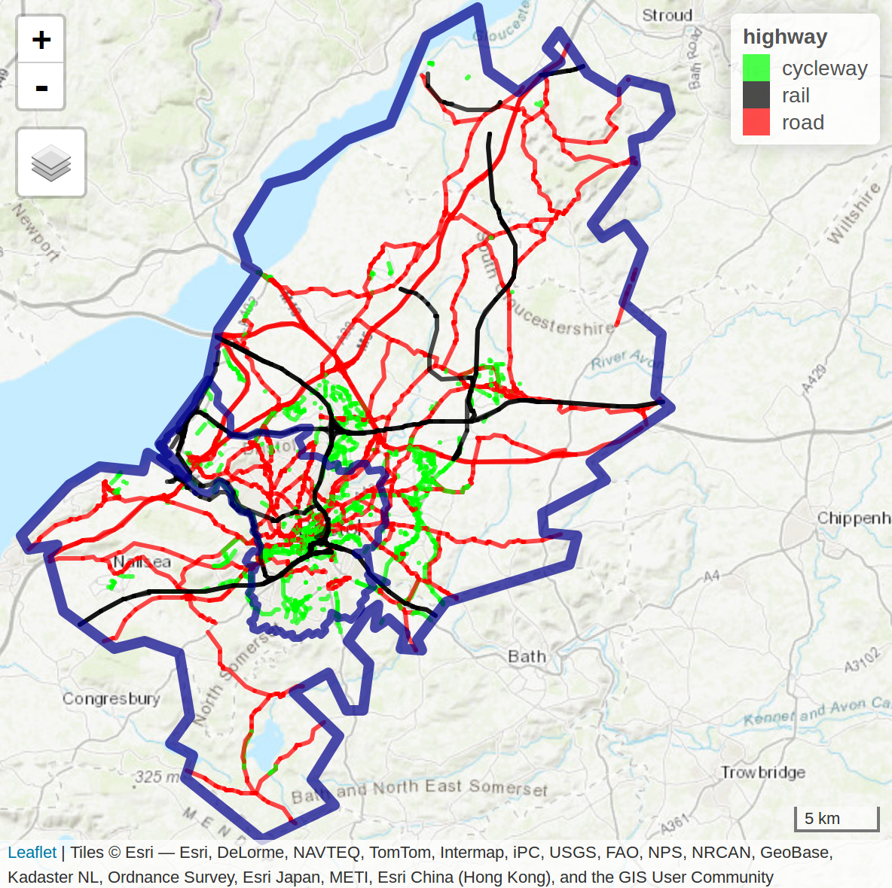

# Prerequisite

This exercise is a reduced version of [https://geocompr.robinlovelace.net/](https://geocompr.robinlovelace.net/) Chapter 13. If you want more precision and the exercise in full length please refer to it.

For this exercise you will need the following packages:

```{r, message = FALSE}
library(sf)
library(dplyr)
library(spDataLarge)
library(stplanr)      # geographic transport data package
library(tmap)
```

# Background

Transport is an inherently geospatial activity. It involves traversing continuous geographic space between A and B, and infinite localities in between. It is therefore unsurprising that transport researchers have long turned to geocomputational methods to understand movement patterns and that transport problems are a motivator of geocomputational methods.

This exercise introduces the geographic analysis of transport systems at different geographic levels, including:

  * **Areal units:** transport patterns can be understood with reference to zonal aggregates such as the main mode of travel (by car, bike or foot, for example) and average distance of trips made by people living in a particular zone.
  
  * **Desire lines:** straight lines that represent ‘origin-destination’ data that records how many people travel (or could travel) between places (points or zones) in geographic space.
  
  * **Routes:** these are lines representing a path along the route network along the desire lines defined in the previous bullet point.
  
  * **Nodes:** these are points in the transport system that can represent common origins and destinations and public transport stations such as bus stops and rail stations.
  
  * **Route networks:** these represent the system of roads, paths and other linear features in an area. They can be represented as geographic features (representing route segments) or structured as an interconnected graph, with the level of traffic on different segments referred to as ‘flow’ by transport modelers.
  
Transport systems are dynamic systems adding additional complexity. The purpose of geographic transport modeling can be interpreted as simplifying this complexity in a way that captures the essence of transport problems. Selecting an appropriate level of geographic analysis can help simplify this complexity, to capture the essence of a transport system without losing its most important features and variables

Typically, models are designed to solve a particular problem. For this reason, this chapter is based around a policy scenario, introduced in the next section, that asks: how to increase cycling in the city of Bristol?

# Bristol as a case study

In this exercise we will take Bristol as a case study. THe main reason is that all the data you need is included in the package spDataLarge. Bristol, a city in the west of England, around 30 km east of the Welsh capital Cardiff.

```{r echo=FALSE, out.width='150%'}

```

In terms of transport, Bristol is well served by rail and road links, and has a relatively high level of active travel. 19% of its citizens cycle and 88% walk at least once per month

8% of the population said they cycled to work in the 2011 census, compared with only 3% nationwide.

Despite impressive walking and cycling statistics, the city has a major congestion problem. Part of the solution is to continue to increase the proportion of trips made by cycling.

In this exercise we will see how GIS and R can be used to support sustainable transport planning. We will:

  * **Describe** the geographical pattern of transport behavior in the city
  * **Identify** key public transport nodes and routes along which cycling to rail stations could be encouraged, as the first stage in multi-model trips
  * **Analyze** travel ‘desire lines’, to find where many people drive short distances
  * **Identify** cycle route locations that will encourage less car driving and more cycling

# Transport zones

The simplest way to define a study area is often the first matching boundary returned by OpenStreetMap, which can be obtained using **osmdata** with a command such as `bristol_region = osmdata::getbb("Bristol", format_out = "sf_polygon")`. This will return a detailed polygon of Bristil, representing the official boundary of the city (see the inner blue boundary in Figure 12.1) but there are a couple of issues with this approach:

  * The first OSM boundary returned by OSM may not be the official boundary used by local authorities
  * Even if OSM returns the official boundary, this may be inappropriate for transport research because they bear little relation to where people travel
  
**Travel to Work Areas (TTWAs)** address these issues by creating a zoning system analogous to hydrological watersheds. TTWAs were first defined as contiguous zones within which 75% of the population travels to work.
Because Bristol is a major employer attracting travel from surrounding towns, its TTWA is substantially larger than the city bounds.

The polygon representing this transport-orientated boundary is stored in the object `bristol_ttwa`, provided by the `spDataLarge` package loaded at the beginning of this exercise.

The 102 zones used in this exercise are stored in `bristol_zones`:

```{r}
# Get the data
bristol_zones <- bristol_zones

# Plot the data
tm_shape(bristol_zones) +
  tm_polygons()
```

Note the zones get smaller in densely populated areas. This is because each zone host a similar number of persons.

bristol_zones contains no attribute data on transport, however, only the name and code of each zone:

```{r}
names(bristol_zones)
```

To add travel data, we will undertake an attribute join. We will use travel data from the UK’s 2011 census question on travel to work, data stored in `bristol_od`, which was provided by the ons.gov.uk data portal. `bristol_od` is an origin-destination (OD) dataset on travel to work between zones from the UK’s 2011 Census.

The first column is the ID of the zone of origin and the second column is the zone of destination. `bristol_od` has more rows than `bristol_zones`, representing travel between zones rather than the zones themselves:

```{r}
nrow(bristol_od)
nrow(bristol_zones)
```

The results of the previous code chunk shows that there are more than 10 OD pairs for every zone, meaning we will need to aggregate the origin-destination data before it is joined with bristol_zones (Otherwise we will end up with a lot of duplicates!)

```{r}
zones_attr <- bristol_od %>% 
  # group the data by zone of origin
  group_by(o) %>%  
  #aggregated the variables in the bristol_od dataset if they were numeric, to find the total number of people living in each zone by mode of transport
  summarize_if(is.numeric, sum) %>%
  # renamed the grouping variable o so it matches the ID column geo_code in the bristol_zones object
  dplyr::rename(geo_code = o) 

# We vizualise the result
head(zones_attr)
```

`zones_attr` can now be joined to `bristol_zones`. This is done using the `left_join` function.

```{r}
zones_joined <- left_join(bristol_zones, zones_attr, by = "geo_code")

# Check which columns we have in zones_joined
names(zones_joined)
```

The result is `zones_joined`, which contains new columns representing the total number of trips originating in each zone in the study area (almost 1/4 of a million) and their mode of travel (by bicycle, foot, car and train).

We can illustrate the geographic distribution of trips origin:

```{r}
tm_shape(zones_joined) +
  tm_polygons(col = "all")
```

And we can do the same to vizualise the zones of destinations:
```{r}
zones_od = bristol_od %>% 
  group_by(d) %>% 
  summarize_if(is.numeric, sum) %>% 
  dplyr::select(geo_code = d, all_dest = all) %>% 
  inner_join(zones_joined, ., by = "geo_code")

# Make the map of zones of destination
tm_shape(zones_od) +
  tm_polygons(col = 'all_dest')
```

The map shows that the most common destination zones concentrated in Bristol city center, where indeed most people work.

# Desire lines

Unlike zones, which represent trip origins and destinations, desire lines connect the centroid of the origin and the destination zone, and thereby represent where people desire to go between zones. They represent the quickest ‘bee line’ or ‘crow flies’ route between A and B that would be taken, if it were not for obstacles such as buildings and windy roads getting in the way.

We have already loaded data representing desire lines in the dataset bristol_od. This origin-destination (OD) data frame object represents the number of people traveling between the zone represented in o and d, as illustrated below:

```{r}
od_top5 = bristol_od %>% 
  arrange(desc(all)) %>% 
  top_n(5, wt = all) # We take the 5 first rows

od_top5
```

The resulting table provides a snapshot of Bristolian travel patterns in terms of commuting (travel to work). It demonstrates that walking is the most popular mode of transport among the top 5 origin-destination pairs, that zone E02003043 is a popular destination (Bristol city center, the destination of all the top 5 OD pairs), and that the intrazonal trips, from one part of zone E02003043 to another (first row of the table), constitute the most traveled OD pair in the dataset.

However, the data as presented like this is not very useful from a policy perspective. We would like to know the percentage of each desire line that is made by these two active modes

```{r}
bristol_od$Active = (bristol_od$bicycle + bristol_od$foot) /
  bristol_od$all * 100
```


There are two main types of OD pair: interzonal and intrazonal. 

  * Interzonal OD pairs represent travel between zones in which the destination is different from the origin. 
  * Intrazonal OD pairs represent travel within the same zone (see the top row of previous table). The following code chunk splits od_bristol into these two types:

```{r}
od_intra = filter(bristol_od, o == d)
od_inter = filter(bristol_od, o != d)
```

The next step is to convert the interzonal OD pairs into an `sf` object representing desire lines that can be plotted on a map with the stplanr function `od2line()`.

```{r}
desire_lines = od2line(od_inter, zones_od)
```

We can then vizualize the desire lines. We use `qtm` function from the `tmap` package, `qtm` basically builds a "quick tmap":

```{r}
qtm(desire_lines, lines.lwd = "all")
```

And with some more fancy coding:

```{r}
desire_lines_top5 = od2line(od_top5, zones_od)
# tmaptools::palette_explorer()
tm_shape(desire_lines) +
  tm_lines(palette = "plasma", breaks = c(0, 5, 10, 20, 40, 100),
    lwd = "all",
    scale = 9,
    title.lwd = "Number of trips",
    alpha = 0.6,
    col = "Active",
    title = "Active travel (%)"
  ) +
  tm_shape(desire_lines_top5) +
  tm_lines(lwd = 5, col = "black", alpha = 0.7) +
  tm_scale_bar()
```

The map shows that the city center dominates transport patterns in the region, suggesting sustainable transport policies should be prioritized there, although a number of peripheral sub-centers can also be seen. Next it would be interesting to have a look at the distribution of interzonal modes, e.g. between which zones is cycling the least or the most common means of transport.

# Routes

From a geographer’s perspective, routes are desire lines that are no longer straight: the origin and destination points are the same, but the pathway to get from A to B is more complex. Desire lines contain only two vertices (their beginning and end points) but routes can contain hundreds of vertices if they cover a large distance or represent travel patterns on an intricate road network (routes on simple grid-based road networks require relatively few vertices). Routes are generated from desire lines — or more commonly origin-destination pairs — using routing services which either run locally or remotely.

Instead of routing all desire lines generated in the previous section, which would be time and memory-consuming, we will focus on the desire lines of policy interest. The benefits of cycling trips are greatest when they replace car trips. Clearly, not all car trips can realistically be replaced by cycling. However, 5 km Euclidean distance (or around 6-8 km of route distance) can realistically be cycled by many people, especially if they are riding an electric bicycle (‘ebike’). We will therefore only route desire lines along which a high (300+) number of car trips take place that are up to 5 km in distance.
The routing will be done using the function `line2route()` from the `stplanr` package.

```{r}
# Calculate the distance
desire_lines$distance = as.numeric(st_length(desire_lines))

# Filter the observations with trajects involving high numbers of cars and that are only 5 or less km
desire_carshort = dplyr::filter(desire_lines, car_driver > 300 & distance < 5000)
```

At this point we would need to route the desired lines. We would have to use the function `line2route` like this:

```{r, eval = FALSE}
route_carshort = line2route(desire_carshort, route_fun = route_osrm)
```

Feel free to download the data and try it!

However this step is complicated as we need to connect to the API of (openrouteservice)[https://maps.openrouteservice.org/].

We will use the pre-made routes included in the `SpDataLarge` package.

```{r}
# Load the data from the package
route_carshort <- route_carshort
```

The new route dataset contains distance (referring to route distance this time) and duration fields (in seconds) which could be useful. However, for the purposes of this section, we are only interested in the **route geometry**, from which route distance can be calculated. 

```{r}
# Extract the route geometry and add the column of new polygons
desire_carshort$geom_car = st_geometry(route_carshort)

# Tell R that we want the spatial object to have the new column as its "default geometry"
desire_carshort <- st_set_geometry(desire_carshort, desire_carshort$geom_car)
```


```{r}
# We set tmap into an interactive mode
tmap_mode('view')
tm_shape(desire_carshort) +
  tm_lines(palette = "plasma",
           scale = 9,
           title.lwd = "Number of trips",
           alpha = 0.6,
           col = "car_driver",
  ) +
  tm_lines(lwd = 5, col = "black", alpha = 0.7) 
```

With `tmap_mode` set to `view` we get an interactive map. You can select the underlying layer you want to have (choose Open Street Map). This map shows that many short car trips take place in and around Bradley Stoke. It is easy to find explanations for the area’s high level of car dependency: according to Wikipedia, Bradley Stoke is “Europe’s largest new town built with private investment”, suggesting limited public transport provision. Furthermore, the town is surrounded by large (cycling unfriendly) road structures, “such as junctions on both the M4 and M5 motorways”

There are many benefits of converting travel desire lines into likely routes of travel from a policy perspective, primary among them the ability to understand what it is about the surrounding environment that makes people travel by a particular mode.

# Questions and Handout!

Your handout will be made of two parts:
  * Questions
  * Maps
  
First the questions:

  1. We have computed the desire lines along which a high (300+) number of car trips take place that are up to 5 km in distance. From a policy perspective how can this be used?
  2. The analysis presented in this chapter is designed for teaching how geocomputation methods can be applied to transport research. If you were to do this ‘for real’ for local government or a transport consultancy, what top 3 things would you do differently?
  3. What impacts can this kind of analysis have on the climate?
  
Maps:

  1. Map the number of people cycling per zones of Bristol
  2. On the last map we mapped the desired lines for the cars. Using the same dataset, do this for the bicycles.

You should end up with something similar to the maps below. Add a title to the maps and if possible overlap your maps with StreetMap so we can vizualize Bristol area.
  
```{r, echo = FALSE}
tmap_mode(mode = "plot")

map1 <- tm_shape(zones_joined) +
  tm_polygons(col = "bicycle",
              palette = "plasma")

map2 <- tm_shape(desire_carshort) +
  tm_lines(palette = "plasma",
           scale = 9,
           title.lwd = "Number of trips",
           alpha = 0.6,
           col = "bicycle",
  ) +
  tm_lines(lwd = 5, col = "black", alpha = 0.7) 

tmap_arrange(map1, map2)
```

